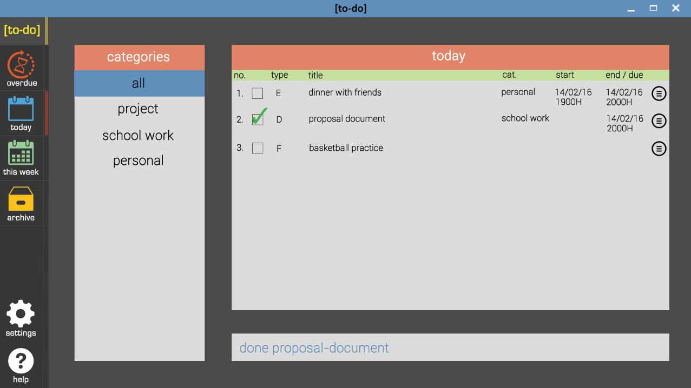
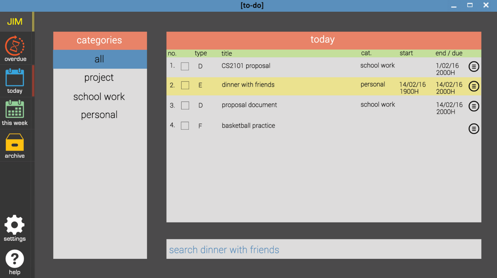
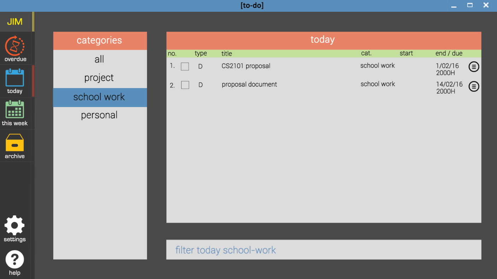

# About

Have you ever had a difficult time monitoring events, deadlines and tasks in your schedule? You might have tried some applications for that but some of them are so complicated that you don't know where to start!

__Journalized Information Manager (J.I.M)__ is all about managing your busy schedule efficiently with a responsive, clean and flexible interface! You can do practically everything just by typing into the command bar! Neat right!

So what are you waiting for? Follow this simple user guide to pick up J.I.M in the shortest time!

# Table of Contents
<!-- MarkdownTOC -->

- [Quick Start](#quick-start)
- [Feature Details](#feature-details)
  - [Basics](#basics)
    - [View](#view)
    - [Create](#create)
    - [Modify](#modify)
    - [Delete](#delete)
    - [Archive](#archive)
    - [Search](#search)
    - [Filter](#filter)
    - [Sort](#sort)
    - [Order](#order)
    - [Categorize](#categorize)
    - [Undo and Redo](#undo-and-redo)
    - [Reschedule](#reschedule)
  - [Advanced](#advanced)
    - [Recurring Tasks](#recurring-tasks)
    - [Natural Commands](#natural-commands)
    - [Set Reminders](#set-reminders)
    - [Shortcuts](#shortcuts)
- [Exiting](#exiting)
- [Commands Sheet](#commands-sheet)

<!-- /MarkdownTOC -->

# Quick Start

1. **Install JDK 8u73 or later**: We are using Java (and we are not the only ones)! Note that earlier Java versions may not be compatible with our application. You can get the latest JDK [here](http://www.oracle.com/technetwork/java/javase/downloads/index.html)!

2. **Download J.I.M**: Got Java working on your computer! Nice! You are now ready to install our application! You may first download our latest release of `JIM.jar` from here:
https://github.com/cs2103jan2016-w13-2j/main/releases

3. **Launch J.I.M** Simply double-click on the `JIM.jar` file to start Journalized Information Manager. Ta-da! You will be greeted with a simple, clean interface with a command bar, much like a Google search bar. This is where you can tell J.I.M what you want and your wishes will come true.
 

   

4. **Start using J.I.M** Give the basic commands a shot! Enter a command and hit `ENTER`! Try some of the following commands for start:
     * `add` `event` `<TITLE> <START DATE> <START TIME> <DURATION>` - creates a new event
      (e.g. _add event group-discussion 10-Feb-2016 3:00PM 3-hours_)
     * `add` `deadline` `<TITLE> <END DATE> <END TIME>` - creates a deadline
      (e.g. _add deadline submit-proposal 14-Feb-2016 11:59PM_)
     * `add` `task` `<TITLE>` - creates a floating task
      (e.g. _add task buy-coffee-for-boss_)
     * `exit` - Exit J.I.M using the command bar

For more features and magic, refer to our 'Feature Details' section below!

# Feature Details

## Basics
  - [View](#view)
  - [Create](#create)
  - [Modify](#modify)
  - [Delete](#delete)
  - [Archive](#archive)
  - [Search](#search)
  - [Filter](#filter)
  - [Sort](#sort)
  - [Order](#order)
  - [Categorize](#categorize)
  - [Undo and Redo](#undo-and-redo)
  - [Reschedule](#reschedule)

  ### View

  

  Right at the start, you will be able to review all your current events, deadlines and tasks.
  On the extreme left, you will see a system menu tab bar that defines all the available views. The default view is the home view, where you will see the entire list of events, deadlines and tasks in your schedule.

  > NOTE: You may navigate through these tabs using the following key commands: `home` , `overdue` , `today` , `week` , `archive` , `settings` , `help`. For more syntactic shortcuts, see [Shortcuts](#shortcuts).

  ### Create
  To create a new item in your scheduler, you may use the command `add` , followed by a series of fields, depending on what type of item you would like to add:

  * `add` `event` `<TITLE> <START-DATE> <START-TIME> <QUANTITY> <TIME-UNIT>` - creates a new event

  `event` is a type of agenda item that has a start and end date-time. To add an event, you will have to specify the `<TITLE>` of the event _(with spaces replaced by '-')_, the `<START-DATE>` in the format `DD/MM/YYYY` or `DD-MMM-YYYY`, the `<START-TIME>` in the format `HH:MM:?M`. Acceptable `<TIME-UNIT>` fields include: `day` , `hour` , `min`.

  e.g. `add` `event` `group-discussion` `10-Feb-2016` `3:00PM` `3` `hour`

  * `add` `deadline` `<TITLE> <END-DATE> <END-TIME>` - creates a deadline

  `deadline` is a type of agenda item that has only the end date-time. To add a deadline, you will have to specify the `<TITLE>` of the deadline _(with spaces replaced by '-')_, the `<END-DATE>` in the format `DD/MM/YYYY` or `DD-MMM-YYYY`, the `<END-TIME>` in the format `HH:MM:?M`.

  e.g. `add` `deadline` `submit-proposal` `14-Feb-2016` `11:59PM`

  * `add` `task` `<TITLE>` - creates a floating task

  `task` is a type of agenda item that has no start or end date-time. To add a task, you will have to specify the `<TITLE>` of the task _(with spaces replaced by '-')_.

  e.g. `add` `task` `buy-coffee-for-boss`

  > NOTE: You may also add [Recurring Tasks](#recurring-tasks) or use [Natural Commands](#natural-commands).

  ### Modify

  * `edit` `<TITLE>` `<FIELD-NAME>` `<NEW VALUE>` , `...`  - overwrites the specified field of an item with the specified new value

  To edit a certain field of an item in your agenda, you may use the command `edit` , followed by the `<TITLE>` of the item, the `<FIELD-NAME>` you would like to edit, and the `<NEW-VALUE>` to replace the old field value.

  Valid `<FIELD-NAME>` are: `TITLE` , `START-DATE` , `END-DATE` , `START-TIME` , `END-TIME` , `START` (start date-time), `END` (end date-time), `QUANTITY` , `TIME-UNIT` , `DURATION` (QUANTITY-TIMEUNIT) , `CATEGORY` , `REMINDER`. Wondering how you may set a category or reminder? You may find out more from the [Categorize](#categorize) and [Set Reminders](#set-reminders) feature.

    e.g. `edit` `submit-proposal` `END-TIME` `8:30PM`  
    e.g. `edit` `submit-proposal` `END-TIME` `8:30PM` , `CATEGORY` `media-project`  
    e.g. `edit` `executive-meeting` `DURATION` `5-hour`

  ### Delete

  * `delete` `<TITLE>` , `...` - deletes the item with the specified title from your agenda

  To remove a certain item from your agenda, you may use the command `delete` , followed by the `<TITLE>` of the item you wish to delete. Do note that deleted items will not be archived but instead will be removed from the application for good.

    e.g. `delete` `my-mistake`  
    e.g. `delete` `my-mistake-1` ,  `my-mistake-2` , `my-mistake-3`

  > NOTE: In case you have accidentally deleted something important and you wish to recover, refer to our [Undo and Redo](#undo-and-redo) feature.

  ### Archive

  

  * `done` `<TITLE>` , `...` - marks the item with the specified title as completed and sends it into the archive box

  To archive an item in your agenda, you may use the command `done` , followed by the `<TITLE>` of the item you wish to archive. Do note that archived items may still be retrieved from the archive view by typing `archive`. However, they will not trigger any reminders or show up in your inbox.

    e.g. `done` `buy-coffee-for-boss`  
    e.g. `done` `buy-coffee-for-boss` , `submit-folders` , `project-proposal`

  ### Search

  

  * `search` `<TITLE>` - highlights the item with the specified title and brings the item to focus

  To look for an item in your agenda, you may use the command `search` , followed by the `<TITLE>` of the item you are looking for. If the item exists in the current view, it will be highlighted. If the item exists but is not present in the current view, and you will be brought to the `home` tab with the item highlighted and in focus. Otherwise if the item does not exist, an error message will appear at the command line.

    e.g. `search` `prepare-documents-for-meeting`

  ### Filter

  

  * `filter` `<VIEW>` `<CATEGORY>` - filters the display for items belonging to a specific view and/or category

  To view items belonging to a specific view and/or category, you may use the command `filter` , followed by a valid `VIEW` or `CATEGORY`, or both.

    e.g. `filter` `overdue` `media-project`  
    e.g. `filter` `today`
    e.g. `filter` `personal`

  ### Sort

  * `sort` `<FIELD-NAME> <ASCDES>` , `...` - orders the items in the current view list by field(s) in the specified order, first by the earliest field specified

  To sort the current list of items in your agenda automatically by a certain field, you may use the command `sort`, followed by the series of `<FIELD-NAME>` and the order: `ASC` for ascending and `DES` for descending.

  Valid `<FIELD-NAME>` are: `TITLE` , `START-DATE` , `END-DATE` , `START-TIME` , `END-TIME` , `START` (start date-time), `END` (end date-time), `QUANTITY` , `TIME-UNIT` , `DURATION` (QUANTITY-TIMEUNIT) , `CATEGORY` , `REMINDER`.

    e.g. `sort` `END` `ASC`  
    e.g. `sort` `START` `ASC` , `TITLE` `DES`

    > NOTE: To manually sort the list in the current view, consider [Order](#order).

  ### Order

  To sort a list manually, you may use the command `insert` or `switch`.

  * `insert` `<TITLE>` `<BEFAFT>` `<TITLE>` - manually inserts a specified item before or after another specified  item in a view list

  To insert an item before another, you may use the command `insert`, followed by `<TITLE>` of the item to be moved, `BEF` and finally the `<TITLE>` of the fixed reference item.

  Similarly, to insert an item after another, you may interchange `BEF` with `AFT`.

    e.g. `insert` `draft-speech` `BEF` `speech-giving` 

  * `switch` `<TITLE>` `<TITLE>` - manually swaps the position of two items on the view list

  To switch the position of two items in a list,  you may use the command `switch`, followed by the `<TITLE>` of the two items.

    e.g. `switch` `gym` `buy-coffee`

  ### Categorize

  * `label` `<TITLE>` `<CATEGORY>` - categorizes a specified item with a category or label

  To categorize an item with a specific title, you may use the command `label`, followed by `<TITLE>` of the item and the `<CATEGORY>` you would like to categorize the item under.

    e.g. `label` `jogging-with-Lucy personal`

  ### Undo and Redo

  * `undo` `<#STEPS>` - undo the last few steps taken

  To undo, you may use the command `undo` to undo your last step, or followed by `<#STEPS>` to undo a certain specified number of steps, with `<#STEPS>` being an integer from 1 to 10.

  * `redo` `<#STEPS>` - redo the last few steps taken

  To redo, you may use the command `redo` to redo your last few steps, or followed by `<#STEPS>` to redo a certain specified number of steps, with `<#STEPS>` being an integer less than or equal to the number of steps previously undone.

    e.g. `undo` `4`  
    e.g. `redo`

  > NOTE: If a non-redo action is performed after undo, you will be unable to use redo to recover to the previous state(s).

  ### Reschedule

  * `postpone` `<TITLE>` `<QUANTITY>` `<TIME-UNIT>` - postpones a certain event or deadline with the specified title for a certain duration

  To postpone an event or deadline, you may use the command `postpone` to push an event or deadline with `<TITLE>` for a `<QUANTITY>` of a specified `<TIME-UNIT>`. Acceptable `<TIME-UNIT>` fields include: `day` , `hour` , `min`.

    e.g. `postpone` `valentine's-day-dinner` `1` `hour`

  * `forward` `<TITLE>` `<QUANTITY>` `<TIME-UNIT>`   - bring forward a certain event or deadline with the specified title for a certain duration

  To bring forward an event or deadline, you may use the command `forward` to bring forward an event or deadline with `<TITLE>` for a `<QUANTITY>` of a specified `<TIME-UNIT>`. Acceptable `<TIME-UNIT>` fields include: `day` , `hour` , `min`.

    e.g. `forward` `PowerPoint-slides-submission` `1` `day`

## Advanced
  - [Recurring Tasks](#recurring-tasks)
  - [Set Reminders](#set-reminders)
  - [Shortcuts](#shortcuts)
  - [Natural Commands](#natural-commands)

  ### Recurring Tasks

  * `<every-ddd-...>` as `<START-DATE>` or `<END-DATE>` with `until` `<END-RECURRING-DATE>` - repeats the event or deadline for every specific days until a certain specific day

  To set recurring events or deadlines, you may replace `<START-DATE>` or `<END-DATE>` in the `add` feature with `<every-ddd-...>` expression, and (optionally) end the recurrence with a `until` `<END-RECURRING-DATE>` command at the end. `<END-RECURRING-DATE>` is in the format `DD/MM/YYYY` or `DD-MMM-YYYY`. Possible values for `ddd` includes: `mon` , `tue` , `wed` , `thu` , `fri` , `sat` , `sun` , `day`.

    e.g. `add` `deadline` `submit-minutes` `every-tue` `11:59PM` `until` `14-Feb-2016`  
    e.g. `add` `deadline` `workout` `every-wed-fri` `8:00PM` (no end to recurrence)  
    e.g. `add` `event` `dinner` `every-day` `7:00PM` `1` `hour`

  ### Set Reminders

  * `add-remind` - replaces `add` , functions as `add` feature but with reminders set to trigger upon `<START-TIME>` or `<END-TIME>` of event and deadline respectively

    e.g. `add-remind` `event` `dinner` `every-day` `7:00PM` `1` `hour` will trigger a reminder for `dinner` every day at 7:00PM

  * `remind` `<TITLE>` - sets reminder for the event or deadline with the specified title to trigger upon `<START-TIME>` or `<END-TIME>` of event and deadline respectively

    e.g. `remind` `workout`

  * `add-remind-bef` `...` `DURATION` - replaces `add` , functions as `add` feature but with reminders set to trigger `<DURATION>` before event `<START-TIME>` or deadline `<END-TIME>`

    e.g. `add-remind-bef` `event` `dinner` `every-day` `7:00PM` `1` `hour` `30-min` will trigger a reminder for `dinner` every day at 6:30PM

  * `remind-bef` `<TITLE>` `<DURATION>` - sets reminder for event or deadline with specified title to trigger `<DURATION>` before the event `<START-TIME>` or the deadline `<END-TIME>`. `<DURATION>` is expressed as `<QUANTITY-TIMEUNIT>`

    e.g. `remind-bef` `workout` `10-min`

  ### Shortcuts

  * List Number as Title

  You may use view list numbers as replacement for `<TITLE>` when referring to a specific item in your agenda.

    e.g. `done` `1` , `2` , `4`  
    e.g. `delete` `3` , `5`

  * Launch and Hide

  You may use `CTRL` + `SHIFT` + `J` to activate or minimize J.I.M GUI

  * UI Navigation

  You may use `LEFTARROW` and `RIGHTARROW` to scroll and filter by `CATEGORY`.

  You may use `UPARROW` and `DOWNARROW` to scroll and browse items in your current view list.

  ### Natural Commands

  * Event Dates

    Try entering special days and occasions by name instead of by date.

      e.g. `Valentines` = `14-Feb-2016`

  * Smart Time

    Try specifying `morning` , `noon` , `afternoon` , `evening` , `night` , `midnight` for time fields. By default, these are the assigned values:

    `morning` or `breakfast` = `8:00AM`  
    `noon` or `lunch` = `12:00PM`  
    `afternoon` = `2:00PM`  
    `evening` or `dinner` = `6:00PM`  
    `night` = `8:00PM`  
    `midnight` = `12:00AM`

    > NOTE: These fields can be re-assigned.

  * Short Forms, Redundancies and Abbreviations

    You may use short forms or abbreviations interchangeably. You may also use alternative words to mean what you say.

      e.g. `8pm` = `8:00PM`
      e.g. `mon` = `Monday`
      e.g. `rem` = `remind`
      e.g. `completed` = `done`

  * Action Verbs, Adverbs of Time and Prepositions

    J.I.M will recognize verbs as actions or commands, adverbs of time as a recurrence pattern, and prepositions as the prefix to date and time fields.

    e.g.
        `add` `deadline` `close-financial-year` `05-Jan-2016` `12:00PM`

          can also be written as

        `close financial year` `by` `tmr` `afternoon`

  * User Customization

    You may choose to assign your own shortcuts and abbreviations. To do so, you can use the following keywords:

    `assign` `<SHORTHAND>` `<MEANING>` : assigns `<SHORTHAND>` to represent `<MEANING>`  
    `unassign` `<SHORTHAND>` : removes any assignment made to `<SHORTHAND>`  
    `reset-assign` : resets all assignment fields to factory default

# Exiting

To terminate the application and close the application window, simply click the close button on the windows or type `exit` in the command bar.

# Commands Sheet

Here is a compiled list of command keywords:

Command | Description
------- | ------------
`add` `event` `<TITLE>` `<START-DATE>` `<START-TIME>` `<QUANTITY>` `<TIME-UNIT>` | creates a new event
`add` `deadline` `<TITLE>` `<END-DATE>` `<END-TIME>` | creates a new deadline
`add` `task` `<TITLE>` | creates a new floating task
`edit` `<TITLE>` `<FIELD-NAME>` `<NEW-VALUE>` , `...`  | overwrites the specified field of an item with the specified new value
`delete` `<TITLE>` , `...` | deletes the item with the specified title from your agenda
`done` `<TITLE>` , `...` | marks the item with the specified title as completed and sends it into the archive box
`search` `<TITLE>` | highlights the item with the specified title and brings the item to focus
`filter` `<VIEW>` `<CATEGORY>` | filters the display for items belonging to a specific view and/or category
`sort` `<FIELD-NAME>` `<ASCDES>` , `...` | orders the items in the current view list by field(s) in the specified order, first by the earliest field specified.
`insert` `<TITLE>` `<BEFAFT>` `<TITLE>` | manually inserts a specified item before or after another specified  item in a view list.
`switch` `<TITLE>` `<TITLE>` | manually swaps the position of two items on the view list.
`label` `<TITLE>` `<CATEGORY>` | categorizes a specified item with a category or label
`undo` `<#STEPS>` | undo the last few steps taken
`redo` `<#STEPS>` | redo the last few steps taken
`postpone` `<TITLE>` `<QUANTITY>` `<TIME-UNIT>` | postpones a certain event or deadline with the specified title for a certain duration
`forward` `<TITLE>` `<QUANTITY>` `<TIME-UNIT>` | bring forward a certain event or deadline with the specified title for a certain duration
`<every-ddd-...>` as `<START-DATE>` or `<END-DATE>` with `until` `<END-RECURRING-DATE>` | repeats the event or deadline for every specific days until a certain specific day
`add-remind` | replaces `add` , functions as `add` feature but with reminders set to trigger upon `<START-TIME>` or `<END-TIME>` of event and deadline respectively
`remind` `<TITLE>` | sets reminder for the event or deadline with the specified title to trigger upon `<START-TIME>` or `<END-TIME>` of event and deadline respectively
`add-remind-bef` `...` `DURATION` | replaces `add` , functions as `add` feature but with reminders set to trigger `<DURATION>` before event `<START-TIME>` or deadline `<END-TIME>`
`remind-bef` `<TITLE>` `<DURATION>` | sets reminder for event or deadline with specified title to trigger `<DURATION>` before the event `<START-TIME>` or the deadline `<END-TIME>`. `<DURATION>` is expressed as `<QUANTITY-TIMEUNIT>`
`<VIEW>` | navigates to the specified view
`exit` | quits and closes J.I.M

# Units and Values

Here is a compiled list of acceptable values for static fields:

Field | Values and Format
--------| ------------
`<TITLE>` | a string with spaces marked by '-'
`<START-DATE>` | `DD/MM/YYYY` or `DD-MMM-YYYY`
`<START-TIME>` | `HH:MM:?M`
`<QUANTITY>` | a float value
`<TIME-UNIT>` | `day` , `hour` , `min`
`<END-DATE>` | `DD/MM/YYYY` or `DD-MMM-YYYY`
`<END-TIME>` | `HH:MM:?M`
`<FIELD-NAME>` | `TITLE` , `START-DATE` , `END-DATE` , `START-TIME` , `END-TIME` , `START` , `END` , `QUANTITY` , `TIME-UNIT` , `DURATION` , `CATEGORY` , `REMINDER`
`<NEW-VALUE>` | a value following the format specified for the particular field
`<VIEW>` | `home` , `overdue` , `today` , `week` , `archive` , `settings` , `help`
`<CATEGORY>` | name of an existing category, or `all`
`<ASCDES>` | `ASC` , `DES`
`<BEFAFT>` | `BEF` , `AFT`
`<#STEPS>` | an integer from 1 to 10
`<ddd>` | `mon` , `tue` , `wed` , `thu` , `fri` , `sat` , `sun` , `day`
`<END-RECURRING-DATE>` | `DD/MM/YYYY` or `DD-MMM-YYYY`
`<DURATION>` | `<QUANTITY>-<TIME-UNIT>`
